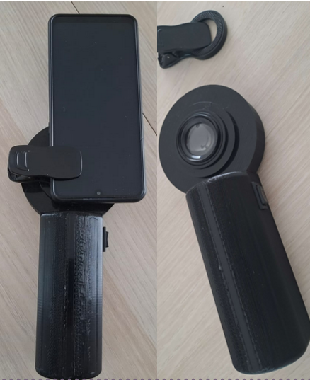
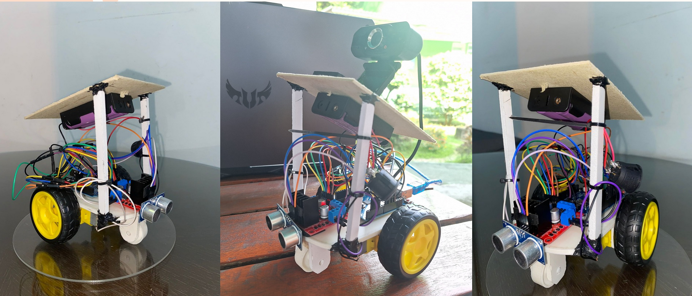
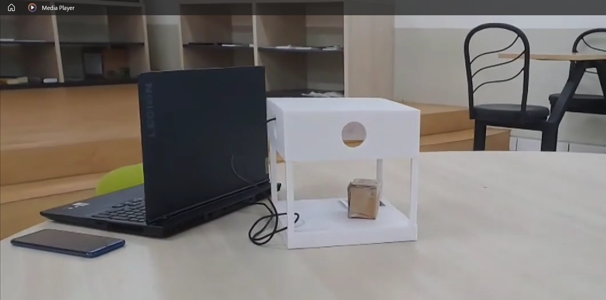

# Machine Learning Engineer

### Education
- Bachelor of Science
- Binus ASO School of Engineering 
- GPA: 3.83/4.00
- September 2021 - September 2025

## Work Experience
**Machine Learning Teaching Assistant @ Binus ASO School of Engineering (_Feb 2025- June 2025_)**
- Evaluated and provided constructive feedback on student assignments and projects.
- Enhanced student understanding of machine learning concepts by incorporating real-world examples and case studies into lessons.
- Documented attendance and completed assignments to maintain full class and student records.
- Checked assignments and provided grades according to university standards.

**Junior Researcher @ Binus ASO School of Engineering (_Sep 2024 - Feb 2025_)**
- Conducted extensive literature reviews, summarizing key findings to inform future studies.
- Created a project about an embedded system for heart disease identification based on phonocardiogram signals.
- Worked as a machine learning engineer to train models to predict varying heart diseases.
- Composed a publication to the 2025 9th International Conference on Electrical, Electronics and Information Engineering (ICEEIE) - Electronics Instrumentation and Control.
- Awarded a certificate on 3rd September 2025 for the publication.

**Research & Development Intern @ Xirka RnD Center (_Feb 2024 - June 2024_)**
- Created clear and concise reports summarizing key research findings, facilitating effective communication across teams.
- Developed innovative solutions for complex problems through extensive literature reviews and experimentation.
- Created a project that prevents over fishing by using machine learning to efficiently handle the process through a camera and servo motor.
- Worked as a machine learning engineer to train the model and implement it into the hardware.

## Projects
### Affordable AI Powered Dermatology Technology

This project aims to develop AI based teledermatology which is equipped with a disease identification intelligent system. 
The role I was given for this is to specifically explore Edge AI potential for skin disease identification which is intended to be deployed on low resource device.

### Automatic embedded system for heart disease identification based on phonocardiogram
[Publication](https://ieeexplore.ieee.org/document/11253966)

A portable and low cost device that can be used by both professional and non-professionals to detect for a person’s heart condition as early as possible. 
The device uses a stethoscope with a microphone embedded into it to receive data of the patient’s heartbeat.
The data taken by the stethoscope is used for the machine learning model to classify the patient’s heart in three different categories: normal, murmur or abnormal.
These results are displayed onto a LCD.

### Fish Counter

An automated device that can count accurately the number of fishes and when the machine reaches a specific quota, a barrier lowers down to seal entry. 
The aim of this project is to prevent over fishing, especially in Indonesia which has one of the largest fishing grounds in the world.
A machine learning model is used track the position of the fishes and display a line in the webcam to start counting the fishes that had passed through the line.
An Arduino is used to control the rotations of the motor and block the path to stop fishes from entering the area

### Two Wheel Security Bot

A roaming security robot with two coaxial wheels mounted on either side of an intermediate body, with a centre of mass above the wheel axles, and therefore, must actively stabilize themselves to prevent toppling. 
This robot will provide support to the current limited security system, while CCTV has blind spots and security officer might not be able to patrol 24/7.
This robot will increase the effectiveness of security by patrolling large complex of warehouse or factory lanes.  

### TrackPoint

TrackPoint is an asset tracking & quality control system that tracks the asset ID, location, and condition.
It’s achieved by using a camera to scan for a Barcode, QR Code and the package itself.
The codes contain information on the storage facility (location) and ID, while using Machine Learning to predict the condition of the package.
The mobile app is used to track the location of the box and monitor its conditions and location.

